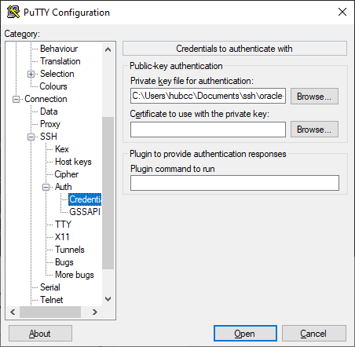

# Basic Server Setup, Caddy, Docker, JDownloader

**Creating the VM in oracle cloud.** 

1. Go to instances, new instance.
2. Select the Always Free image, ARM or x86. 1 core only, recommended 4GB RAM, should be exceed 6 GB.
3. Choose Ubuntu image.
4. Download the SSH key and name it accordingly.

**Key Pair**

Using PuttyGen.

- Place the key in `./ssh/openssh_keys`
- Open PuttyGen, conversion -> import keys
- Save the key files as ppk file in root folder of `./ssh`

Putty

- Grab the IP address in the cloud console
- Give a name in saved sessions
- Go to behavior, choose these options
- Under Data, make sure Terminal-type string is xterm-256color
- Under Terminal -&gt; Features, check "disable application keypad mode" to fix issues with nano
- The private key needs to be load in Connection -&gt; SSH -&gt; Auth -&gt; Credentials




To get the IP address of the VPS at any time

```bash
curl ifconfig.me
```

**Basic Setup +** Docker

1. Installing Caddy web server (simple to use reverse proxy), lightweight, easy and no need for docker. (Nginx is also a good candidate for reverse proxy as the command is easy to memorize and does not require consulting documentation sites. However, the syntax for nginx is extremely complex compared to caddy and might not be easily memorized.

[https://caddyserver.com/docs/install#debian-ubuntu-raspbian](https://caddyserver.com/docs/install#debian-ubuntu-raspbian)

```bash
sudo apt install -y debian-keyring debian-archive-keyring apt-transport-https
curl -1sLf 'https://dl.cloudsmith.io/public/caddy/stable/gpg.key' | sudo gpg --dearmor -o /usr/share/keyrings/caddy-stable-archive-keyring.gpg
curl -1sLf 'https://dl.cloudsmith.io/public/caddy/stable/debian.deb.txt' | sudo tee /etc/apt/sources.list.d/caddy-stable.list
sudo apt update
sudo apt install caddy net-tools
# net-tools is good utility, optionally can install firewall-cmd or nginx
# sudo apt install firewalld nginx
```

2\. Install Docker

[https://docs.docker.com/engine/install/ubuntu/](https://docs.docker.com/engine/install/ubuntu/)

```bash
sudo apt-get update
sudo apt-get install \
    ca-certificates \
    curl \
    gnupg \
    lsb-release
    
sudo mkdir -p /etc/apt/keyrings
curl -fsSL https://download.docker.com/linux/ubuntu/gpg | sudo gpg --dearmor -o /etc/apt/keyrings/docker.gpg

echo \
  "deb [arch=$(dpkg --print-architecture) signed-by=/etc/apt/keyrings/docker.gpg] https://download.docker.com/linux/ubuntu \
  $(lsb_release -cs) stable" | sudo tee /etc/apt/sources.list.d/docker.list > /dev/null
  
sudo apt-get update
sudo apt-get install docker-ce docker-ce-cli containerd.io docker-compose-plugin docker-compose
# code modified to install docker-compose, each space in paragraph indicates a separate step in their official blog
```

```bash
sudo groupadd docker \
sudo usermod -aG docker ubuntu
newgrp docker # activate docker group immediately
```

The machine needs to be rebooted from Oracle Cloud console to finish installation.

**JDownloader**

[https://hub.docker.com/r/jlesage/jdownloader-2](https://hub.docker.com/r/jlesage/jdownloader-2)

```bash
docker run -d \
    --name=jdownloader-2 \
    -p 5800:5800 \
    -v $HOME/appdata/jdownloader-2:/config:rw \
    -v $HOME/Downloads:/output:rw \
    --restart unless-stopped \
    jlesage/jdownloader-2
```

If port forwarding configured properly, entering ipaddress:5800 should work. If not open ports manually.

```bash
sudo iptables -I INPUT 6 -m state --state NEW -p tcp --dport 5800 -j ACCEPT
sudo netfilter-persistent save
```

Other Useful Ports

```bash
sudo iptables -I INPUT 6 -m state --state NEW -p tcp --dport 443 -j ACCEPT
sudo iptables -I INPUT 6 -m state --state NEW -p tcp --dport 80 -j ACCEPT
sudo iptables -I INPUT 6 -m state --state NEW -p tcp --dport 25565 -j ACCEPT
sudo iptables -I INPUT 6 -m state --state NEW -p tcp --dport 19132 -j ACCEPT
sudo iptables -I INPUT 6 -m state --state NEW -p udp --dport 25565 -j ACCEPT
sudo iptables -I INPUT 6 -m state --state NEW -p udp --dport 19132 -j ACCEPT
sudo iptables -I INPUT 6 -m state --state NEW -p udp --dport 51820 -j ACCEPT
sudo netfilter-persistent save
```

**Alternative (firewall-cmd)**

```bash
sudo apt install firewalld
```

Firewalld is a CentOS package, it may be unstable and crash, but command easy to memorize.

```bash
sudo firewall-cmd --zone=public --add-port 19132/tcp --permanent
sudo firewall-cmd --zone=public --add-port 19132/udp --permanent
sudo firewall-cmd --zone=public --add-port 25565/tcp --permanent
sudo firewall-cmd --zone=public --add-port 25565/udp --permanent
sudo firewall-cmd --zone=public --add-port 80/tcp --permanent
sudo firewall-cmd --zone=public --add-port 443/tcp --permanent
sudo firewall-cmd --zone=public --add-port 5800/tcp --permanent
sudo firewall-cmd --reload
```

**Troubleshooting network**

For firewall-cmd, use this command to check all open ports.

```bash
sudo firewall-cmd --list-all
```

Using netstat, or pipe it to grep

```bash
netstat -tln
# | grep 8080 etc...
```

**Configuring JDownloader**

- Go to the JDownloader WebUI
- Go to Settings
- Under general, change the max number of downloads (2) and DL per hoster (1) to minimize issues


- Go to MyJDownloader and configure MyJDownloader account


- Go to extension modules, install and enable "folderwatch"


The configuration for JDownloader is complete and should appear and be functional in WebUI. [Advanced JDownloader](/!documentation/Cloud%20VPS/jdownloader) documentation will be covered in detailed in another section. It is recommended to close port 5800 after configuring to prevent others accessing.

**Basic Caddy Syntax (if applicable)**

If the server that is being setup or restored needs functional service like bookstack or uptime-kuma, reverse proxy is needed.

```bash
sudo nano /etc/caddy/Caddyfile
```

```yaml
{
    email weebly2x10@gmail.com
}

your-uptime-kuma.yoursubdomain.duckdns.org {
        reverse_proxy http://127.0.0.1:3001
}

wiki.yoursubdomain.duckdns.org {
        reverse_proxy http://127.0.0.1:6975
}

```

**Advanced**

[Tunneling Jellyfin and other web services with tailscale and caddy](tunneling-basic-services-jellyfin-web-with-caddy-and-tailscale.md)

[Minecraft Server tunneling via Nginx (tcp only)](tunneling-minecraft-server-tcp-only-with-nginx.md)

[Minecraft Tunneling](tunneling-minecraft-server-tcp-only-with-nginx.md)