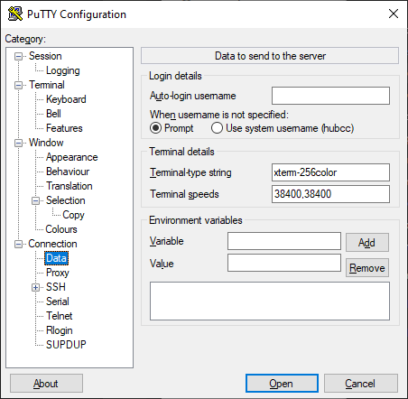
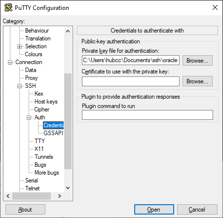

# Basic Server Setup, Caddy, Docker, Tailscale

## Basics
### Creating the VM in oracle cloud

1. Go to instances, new instance.
2. Select the Always Free image, ARM or x86, recommended 4GB RAM.
3. Choose Ubuntu image.
4. Download the SSH key and name it accordingly.

### SSH Keys

Using PuttyGen.

- Place the key in `./ssh/openssh_keys`
- Open PuttyGen, conversion -> import keys
- Save the key files as ppk file in root folder of `./ssh`

Putty

- Grab the IP address in the cloud console
- Give a name in saved sessions
- Go to behavior, choose these options
- Under Data, make sure Terminal-type string is xterm-256color
- Under Terminal -&gt; Features, check "disable application keypad mode" to fix issues with nano
- The private key needs to be load in Connection -&gt; SSH -&gt; Auth -&gt; Credentials





To get the IP address of the VPS at any time

```bash
curl ifconfig.me
```

Useful packages to install
```
htop iotop iftop fio curl gnupg wget neofetch ca-certificates lsb-release fzf screen firewalld net-tools bash-completion
```
## Docker
https://docs.docker.com/engine/install/ubuntu/
```bash
sudo apt-get update
sudo apt-get install \
    ca-certificates \
    curl \
    gnupg \
    lsb-release
    
sudo mkdir -p /etc/apt/keyrings
curl -fsSL https://download.docker.com/linux/ubuntu/gpg | sudo gpg --dearmor -o /etc/apt/keyrings/docker.gpg

echo \
  "deb [arch=$(dpkg --print-architecture) signed-by=/etc/apt/keyrings/docker.gpg] https://download.docker.com/linux/ubuntu \
  $(lsb_release -cs) stable" | sudo tee /etc/apt/sources.list.d/docker.list > /dev/null
  
sudo apt-get update
sudo apt-get install docker-ce docker-ce-cli containerd.io docker-compose-plugin docker-compose
```

```bash
sudo groupadd docker \
sudo usermod -aG docker ubuntu
newgrp docker # activate docker group immediately
```

The machine needs to be rebooted from Oracle Cloud console to finish installation.
## Caddy
### Docker Version Install
Detailed information on installing Caddy has moved to [caddy](../Docker%20Apps/Web/caddy.md)
If Nginx is installed alongside Caddy, it needs to be changed to listen on port 81 instead.
```bash
sudo nano /etc/nginx/sites-enabled/default
```
- change the `server` block's `listen` from 80 to 81
```bash
sudo service nginx restart
```
### Port Forwarding
On the Oracle Cloud side, login and go to `Virtual Cloud Networks`, click the one that's available, then the default subnet, this will bring up the `Security Lists`


- this is an example of SSH port, configure by `Add Ingress Rules` and add the ports accordingly; it's also possible to allow everything and install a firewall in the OS itself

On the Linux machine, either use `iptables` or `firewall-cmd`

=== "Firewall-cmd (recommended)"
	``` bash
	sudo firewall-cmd --zone=public --add-port 19132/tcp --permanent
	sudo firewall-cmd --zone=public --add-port 19132/udp --permanent
	sudo firewall-cmd --zone=public --add-port 25565/tcp --permanent
	sudo firewall-cmd --zone=public --add-port 25565/udp --permanent
	sudo firewall-cmd --zone=public --add-port 80/tcp --permanent
	sudo firewall-cmd --zone=public --add-port 443/tcp --permanent
	sudo firewall-cmd --zone=public --add-port 5800/tcp --permanent
	sudo firewall-cmd --reload
	```
=== "iptables"
	```
	sudo iptables -I INPUT 6 -m state --state NEW -p tcp --dport 443 -j ACCEPT
	sudo iptables -I INPUT 6 -m state --state NEW -p tcp --dport 80 -j ACCEPT
	sudo iptables -I INPUT 6 -m state --state NEW -p tcp --dport 25565 -j ACCEPT
	sudo iptables -I INPUT 6 -m state --state NEW -p tcp --dport 19132 -j ACCEPT
	sudo iptables -I INPUT 6 -m state --state NEW -p udp --dport 25565 -j ACCEPT
	sudo iptables -I INPUT 6 -m state --state NEW -p udp --dport 19132 -j ACCEPT
	sudo iptables -I INPUT 6 -m state --state NEW -p udp --dport 51820 -j ACCEPT
	sudo netfilter-persistent save
	``` ^4f1e6a
#### Troubleshooting

For firewall-cmd, use this command to check all open ports.

```bash
sudo firewall-cmd --list-all
```

Using netstat, or pipe it to grep

```bash
netstat -tln
# | grep 8080 etc...
```

## Tailscale
Installation and setup of basic services is covered in [tunneling basic services](tunneling-basic-services-jellyfin-web-with-caddy-and-tailscale.md). For usage such as exit-node and subnet-routes.
### Exit Node/Subnet Routes
First need to enable IP forwarding.
```bash
echo 'net.ipv4.ip_forward = 1' | sudo tee -a /etc/sysctl.conf
echo 'net.ipv6.conf.all.forwarding = 1' | sudo tee -a /etc/sysctl.conf
sudo sysctl -p /etc/sysctl.conf
```
When using with firewalld, additional configuration is needed such as masquerade.
``` bash
sudo firewall-cmd --add-masquerade --zone=public --permanent 
sudo firewall-cmd --add-interface=tailscale0 --zone=trusted --permanent
sudo firewall-cmd --reload
```
Basic command to advertise as exit-node and subnet routes
```bash
sudo tailscale up --advertise-exit-node --advertise-subnet-routes=10.10.120.0/24
```
When connect tailscale in CLI, additional arguments is needed to accept routes (the command below also activate exit node)
```bash
sudo tailscale up --advertise-exit-node --accept-routes
```
To enable these features, need to go to [admin console](https://login.tailscale.com/admin/machines), go to each machine settings, `Edit Route Settings` and enable exit-node or subnet routes.
## Advanced

[Tunneling Jellyfin and other web services with tailscale and caddy](tunneling-basic-services-jellyfin-web-with-caddy-and-tailscale.md)

[Minecraft Tunneling](tunneling-minecraft-server-tcp-only-with-nginx.md)

## Archived
**Basic Setup +** Docker

1. Installing Caddy web server (simple to use reverse proxy), lightweight, easy and no need for docker. (Nginx is also a good candidate for reverse proxy as the command is easy to memorize and does not require consulting documentation sites. However, the syntax for nginx is extremely complex compared to caddy and might not be easily memorized.

[https://caddyserver.com/docs/install#debian-ubuntu-raspbian](https://caddyserver.com/docs/install#debian-ubuntu-raspbian)

```bash
sudo apt install -y debian-keyring debian-archive-keyring apt-transport-https
curl -1sLf 'https://dl.cloudsmith.io/public/caddy/stable/gpg.key' | sudo gpg --dearmor -o /usr/share/keyrings/caddy-stable-archive-keyring.gpg
curl -1sLf 'https://dl.cloudsmith.io/public/caddy/stable/debian.deb.txt' | sudo tee /etc/apt/sources.list.d/caddy-stable.list
sudo apt update
sudo apt install caddy net-tools
# net-tools is good utility, optionally can install firewall-cmd or nginx
# sudo apt install firewalld nginx
```

**Basic Caddy Syntax (if applicable)**
If the server that is being setup or restored needs functional service like bookstack or uptime-kuma, reverse proxy is needed.
```bash
sudo nano /etc/caddy/Caddyfile
```

```yaml
{
    email weebly2x10@gmail.com
}

your-uptime-kuma.yoursubdomain.duckdns.org {
        reverse_proxy http://127.0.0.1:3001
}

wiki.yoursubdomain.duckdns.org {
        reverse_proxy http://127.0.0.1:6975
}

```
