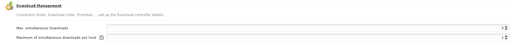
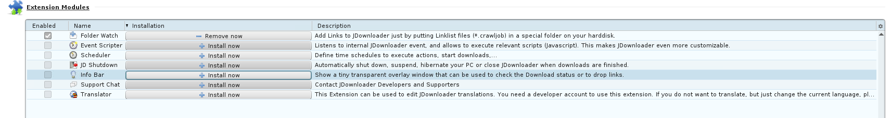

# JDownloader

### Basic Setup
#### Configuring JDownloader

- Go to the JDownloader WebUI
- Go to Settings
- Under general, change the max number of downloads (2) and DL per hoster (1) to minimize issues

- Go to MyJDownloader and configure MyJDownloader account

- Go to extension modules, install and enable "folderwatch"

The configuration for JDownloader is complete and should appear and be functional in WebUI. [Advanced JDownloader](jdownloader.md) documentation will be covered in detailed in another section. It is recommended to close port 5800 after configuring to prevent others accessing.

After setting up JDownloader and it appears well in WebUI.

The section is useless now as UHDMV has shutdown and it's pointless to setup multiple automated JDownloader server on VPS.

### Settings for JDownloader
Debloat settings  https://rentry.org/jdownloader2
**Advanced Settings**
`GraphicalUserInterfaceSettings: Banner` -> disable
`GraphicalUserlnterfaceSettings: Premium Alert Task Column` - > disable
`GraphicalUserInterfaceSeftings: Premium Alert Speed Column` -> disable
`GraphicalUserInterfaceSettings: Premium Alert ETA Column` -> disable
`GraphicalUsserInterfaceSeftings: Special Deal Oboom Dialog Visible On Startup` -> disable
`GraphicalUsserInterfaceSeftings: Special Deals` -> disable
`GraphicalUsserInterfaceSeftings: Donate Button State` -> `Hidden (automode)`

#### Theming
`GraphicalUserInterfaceSettings: Look And Feel Theme` - > `BLACK_EYE`
**For Colors**
`LAFSettings: Color For`
- Panel background and header background and alternate row background- `#ff222222`
- Selected Rows Background - `#ff666666`
- Package Row Background - `#ff333333`
- Mouse Over Row Background - `#ff666666`
- Panel Header Foreground, Tooltip Foreground, Selected Rows Foreground, Package Row Foreground, Mouse Over Row Foreground, Alternate Row Foreground,  Account Temp Error Row Foreground, Account Error Row Foreground- `#ffffffff`
	- basically, change all the black values to white when searching for `color fore`, change everything except blue colors and error color
- Enabled Text Color, Speed Meter Text, Speed Meter Average Text, Config Panel Description Text, Config Header Text Color - `#ffffffff`
- Disabled Text Color - `#ff666666`
	- basically, when searching for `color text`, change all to white except for disabled text