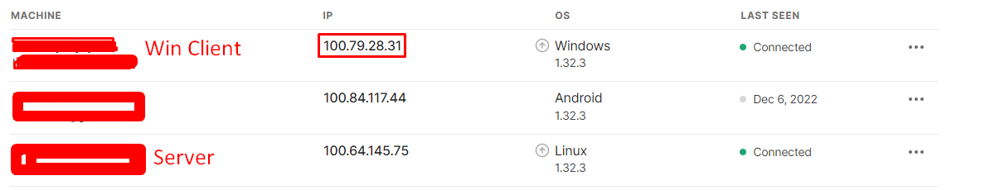

# Tunneling Basic Services (Jellyfin, Web) with Caddy and Tailscale

This procedure is not reproducible yet. Rigorous testing is still required before being documented. Here are the known procedures.

The purpose is to tunnel normal web or network intensive traffic such as Jellyfin when faced with CG-NAT or similar situations (in this case locked down dorm internet), also configure hardware transcoding (in this case NVENC, but Intel QSV for future) to mitigate limitations with Canadian ISP(s).

**Jellyfin Install**

[https://jellyfin.org/downloads/server](https://jellyfin.org/downloads/server)

Download and run the server installer.

**Jellyfin Server Configuration**

**Tailscale (Windows Client)**

[https://tailscale.com/download/windows](https://tailscale.com/download/windows)

Download, install and login.

**Tailscale (Linux Server)**

```bash
curl -fsSL https://tailscale.com/install.sh | sh
```

```bash
sudo tailscale up
```

All the tailscale management is done in the WebUI.



The Windows client is given a tailscale network IP address in 100 range. Check if Windows client is pingable on server.

```bash
ping 100.x.y.z
```

Check if Jellyfin is running and tunneled properly on Oracle cloud. It should get a webpage html rather than unable to resolve host etc.

```bash
curl http://100.x.y.z:8096
```

 **Reverse Proxy**

[/Cloud%20VPS/basic-server-setup-caddy-docker-jdownloader](/Cloud%20VPS/basic-server-setup-caddy-docker-jdownloader)

Caddy installation and syntax is can be found on this page. Replace 127.0.0.1 with the tailscale IP address.

```yaml
{
    email weebly2x10@gmail.com
}

movies.yoursubdomain.duckdns.org {
        reverse_proxy http://100.x.y.z
}
```

It is possible to set use the root domain (yoursub.duckdns.org) or a subfolder domain (movies.yousub.duckdns.org) for Jellyfin. After configuring the Caddyfile.

```bash
sudo systemctl reload caddy
```

Use netstat to check port 80, 443 is being listened. Make sure to [port forward](/Cloud%20VPS/basic-server-setup-caddy-docker-jdownloader#bkmrk-alternative-%28firewal) Oracle VPS.

**Other Services**

Follow the same syntax as the caddy file provided, if the root domain is used, then a subdomain must be used for other services.

**Results**

Inconclusive yet, more testing required.