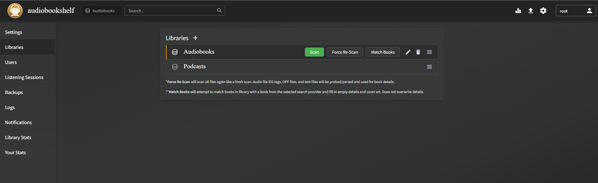

# Audiobookshelf
Audiobooks and podcasts. 
> [!danger]+ UID/GID
> With the newer version of ABS. The environment variables `AUDIOBOOKSHELF_UID` and `GID` are removed, the container now runs as root with no ways to change it; if using the `user` flag in docker, there would be permission error on startup.

Docker-compose, place it in the media apps compose media.yml

```yaml
version: "3.7"
services:
  audiobookshelf:
    image: ghcr.io/advplyr/audiobookshelf:latest
    ports:
      - 13378:80
    volumes:
      - /mnt/m/Audios/audiobooks:/audiobooks # hard drive mount
      - /mnt/m/Audios/podcasts:/podcasts # hard drive mount
      - $HOME/audiobookshelf/config:/config
      - $HOME/audiobookshelf/metadata:/metadata
    restart: unless-stopped
    
  audiobookshelf-permfix:
    container_name: abs-permfix
    image: ubuntu
    networks:
      - public
    command: bash -c "chown -R $${PUID}:$${PGID} /mnt; echo sleeping; sleep $${TIME}"
    volumes:
      - /mnt/data/Audios/audiobooks:/mnt/audiobooks # hard drive mount
      - /mnt/data/Audios/podcasts:/mnt/podcasts # hard drive mount
      - ~/docker/audiobookshelf/config:/mnt/config
      - ~/docker/audiobookshelf/metadata:/mnt/metadata
    environment:
      - PUID=1000
      - PGID=1001
      - TIME=1h
    restart: unless-stopped
```

- The change made to the docker-compose include a `permfix` that automatically `chown` everything in audiobookshelf bind mounts
	- mount everything into `/mnt`
	- change the user and group ID accordingly
## Usage

To add a library, go to settings, libraries and add the path as mounted in docker.

Go to Users, change the root password and create a new user. Note, the user cannot scan library, only the root can do that.



### Adding Media

Make sure the contents are in a separate folder. Follow naming like this. A cover image can also be created. The best bitrate should be under 128 kbps for smooth playback.

```
/audiobooks
--- ./Author - Book
---  --- ./Cover.jpg
---  --- ./book - 001 or book - chapter 1
---  --- ./book - 002
---  --- ./book - 003
```

In the WebUI, make sure logged in as root. Go to settings, library and scan. It will scan the newly added media. Also useful for dealing with unplayable file errors.

It is also possible to **upload via the WebUI**. When files are uploaded this way, it is also be placed in the audiobooks folder. However, it is not possible to add more files via the web upload once it's scanned.

**Additional Metadata**
`Cover.jpg` - cover image
`desc.txt` - descriptions
`*.opf` - XML library file that contains additional metadata such as title, author etc..
**Vocabulary**
`abridged/unabridged` - shortened listening version
`primary/supplementary ebooks` - primary ebooks are

If the media does not match or not have an image, go click the edit icon, go to `Match`, the best result is usually `Audible.com`.


If the chapter does not match, chapters can be edited manually. Go to Chapter and Lookup.

### Mobile App
**[https://play.google.com/store/apps/details?id=com.audiobookshelf.app](https://play.google.com/store/apps/details?id=com.audiobookshelf.app)**

Mobile app also has download functionality; however, by default the download location is inaccessible.  Go to `Local Media` create a New Folder for books or audiobooks and, the app will ask for location.

The statistic of minutes listened is the actual minutes listened, not the minutes of audiobook progress listened (eg. playing at faster speed).

#### Backup/Restore
In the WebUI, go to `Settings` > `Backups` and there will be option for backup/restore. Alternatively, copy the entire appdata folder to another computer.

### Proxy/SSO
#### Reverse Proxy
To reverse proxy properly in Nginx Proxy Manager, ensure `Websocket Support`.
#### Authelia (OIDC)
For use with Authelia OIDC, subdomain (not subfolder) is required. No additional reverse proxy configuration needed. In the Authelia OIDC clients configuration
```yaml
      - id: audiobookshelf
        client_name: Audiobookshelf
        client_secret: '$plaintext${{ env "AUDIOBOOKSHELF_SECRET" }}'
        public: false
        authorization_policy: 'one_factor'
        redirect_uris:
          - 'https://abs.{{ env "DOMAIN_NAME"}}/auth/openid/callback'
          - 'https://abs.{{ env "DOMAIN_NAME"}}/auth/openid/mobile-redirect'
        scopes:
          - 'openid'
          - 'profile'
          - 'email'
```

For configuration in Audiobookshelf, fill in the Issuer URL and click `Auto-Populate`, most important information will be filled out. Fill in the generated client secret manually. These settings need changed 
- Matching existing users by `Match by username` (alternatively add email for each ABS user)
- `Auto Register` - new users if not exist in ABS will be created and linked
Despite OIDC enabled, the internal login can still work, non OIDC users can login.

#### Scripting (Windows)

ffmpeg detect audio silence (for splitting a large audio file into multiple chapters)

```shell
ffmpeg -i input.mp3 -af silencedetect=n=-50dB:d=1.5 -f null -
```

```shell
ffmpeg -i input.mp3 -af silencedetect=n=-50dB:d=1.5 -f null -loglevel debug 2>&1 - | findstr "silence_duration" | find /c /v ""
```

This will find silence parts below -50dB and duration threshold of 1.5s.

The second code (windows cmd only) for linux use grep -c, finds how many silence parts can be detected, this should correlate to number of chapters.

Once the optimal duration is set, use split.py.

ffmpeg that remove silence from audio

```shell
ffmpeg -i input.mp4 -af silenceremove=stop_periods=-1:stop_duration=4:stop_threshold=-50dB -b:a 96k output.mp3
```

- stop\_duration (threshold duration for removing silence part)
- stop\_periods = -1 (search for the entire audio track)

Use edge\_reader.py to utilize Edge AI reader to read the audiobook if only the pdf book is provided.

After reading, put all the recorded files and pdf in the project folder and run processing.py twice.