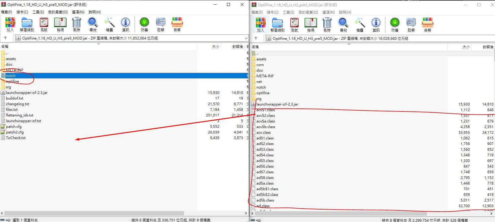

# Minecraft Prep and Install

**Client Setup (Java + Online)**

1. Download [Java](https://www.java.com/download/ie_manual.jsp)
2. Download [OptiFine](https://optifine.net/downloads) the latest version.
3. On the official Minecraft client, go add a new installation and match the version with OptiFine.
4. Download and try the official version, then install OptiFine with Java.
5. Under Settings -&gt; Keep the Launcher open while games are running

**Client Setup (Java + Offline)**

1. Use the client [PolyMC](https://github.com/fn2006/PollyMC/releases/) to enable offline play.
2. Go to the right corner, manage accounts and create an offline account.
3. Click on add an instance and follow the guide.
4. To install OptiFine, need the official launcher first, then download [OptiFine](https://optifine.net/downloads)
5. Extract OptiFine, the extracted file should be ending in \_MOD.jar
6. Open the jar file in WinRAR, then move the files from notch folder into the base folder. Save the jar archive.
7. Go to PolyMC, right click on the instance, click Edit -&gt; Versions -&gt; Add to minecraft.jar and select the modified OptiFine.

**Docker Server Setup**

Docker-compose for minecraft server

```yaml
version: "3.9"
services:
  minecraft:
    image: marctv/minecraft-papermc-server:latest
    restart: unless-stopped
    container_name: mcserver
    environment:
      - MEMORYSIZE=4G
      - PAPERMC_FLAGS=""
      - PUID=1000
      - PGID=1000
    volumes:
      - ~/docker/minecraft:/data:rw
    ports:
      - 25565:25565
      - 19132:19132
    stdin_open: true
    tty: true
```

This downloads the latest version of Minecraft, to use another PaperMC version, need to build the image from scratch.

Warning: <span style="color: rgb(224, 62, 45);">PaperMC cannot be downgraded</span>, only newer version of PaperMC can be installed after first run.

```shell
git clone https://github.com/mtoensing/Docker-Minecraft-PaperMC-Server
# go edit the "ARG version=1.xx.x" to the correct version
docker build -t marctv/mcserver:1.xx.x
```

**Folders and Plugins**

Plugins are located in folder `./plugins` some plugins have .yml files. To update or download plugins, use scp, wget on the server or VSCode.

The `world` folder consists of the save data. It is separated into world, nether, the\_end.

Before starting the server, the `eula.txt` must have *eula=true*.

`bukkit` and `spigot.yml` in the root folder are configuration files for PaperMC.

**Rcon Commands**

To access the rcon-cli, use `docker attach mcserver`, to exit, use Ctrl-P and Q, if using VSCode may need to edit keyboard shortcut.

Editing VSCode Shortcut

Press `Ctrl-Shift-P` and search for keyboard shortcut json.

```json
[
    {
        "key": "ctrl+p",
        "command": "ctrl+p",
        "when": "terminalFocus"
    },

    {
        "key": "ctrl+q",
        "command": "ctrl+q",
        "when": "terminalFocus"
    },

    {
        "key": "ctrl+e",
        "command": "ctrl+e",
        "when": "terminalFocus"
    }

]
```