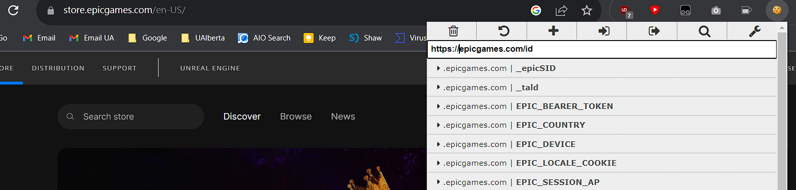

# Epic Games Free Games

**Buy Free Games from Epic Games**

[https://hub.docker.com/r/charlocharlie/epicgames-freegames](https://hub.docker.com/r/charlocharlie/epicgames-freegames)

**Config**

**NEED TO CHANGE**

Email: email address

Password: password

Webhook URL: make a discord channel and click settings. Go to integrations, then webhook, copy webhook URL.

mentioned Users: right click your profile, and click Copy ID

**TOTP**

1. Go here to login. [https://www.epicgames.com/account/password](https://www.epicgames.com/account/password) Login with Epic Games account.
2. Click "enable authenticator app."
3. In the section labeled "manual entry key," copy the key.
4. Use your authenticator app to add scan the QR code.
5. Activate 2FA by completing the form and clicking activate.
6. Once 2FA is enabled, use the key you copied as the value for the TOTP parameter.

**Docker**

```bash
docker run -d -v /home/karis/docker/epicgames:/usr/app/config:rw -p 3000:3000 -m 2g --name epicgames --restart unless-stopped charlocharlie/epicgames-freegames:latest
```

Change the name of the container to a friendly name. Restart unless stopped so it restart automatically.

**Copy and Paste**

The default json configuration is located at /home/karis/docker/epicgames or $HOME/docker/epicgames.

**Fix Login Issue Using Cookies**

[https://store.epicgames.com/en-US/](https://store.epicgames.com/en-US/)

1. Visit this site and make sure it's logged in.
2. Install this extension EditThisCookie [https://chrome.google.com/webstore/detail/editthiscookie/fngmhnnpilhplaeedifhccceomclgfbg/related](https://chrome.google.com/webstore/detail/editthiscookie/fngmhnnpilhplaeedifhccceomclgfbg/related)
3. Open the extension and change the url to epicgames.com/id as in screenshot below
4. Export the cookie



1. Go to $HOME/docker/epicgames and create a new file <email@gmail.com-cookies.json>
2. If the json file is already there, truncate it with --size 0
3. Paste the cookie value to the json file
4. Restart container.

**Update**

```bash
docker pull charlocharlie/epicgames-freegames:latest
docker rm -f epicgames
docker images | grep epicgames
# use docker rmi to remote the corresponding image 
# re run the epicgames docker run command
```