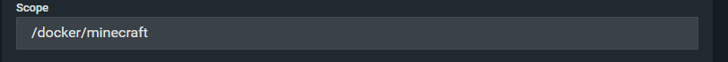
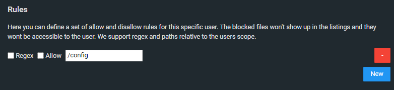
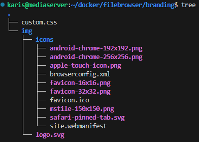

# Filebrowser

Filebrowser app on a webbrowser, port 4455. [free-games-claimer](free-games-claimer.md)

Docker-compose deployment

```yaml
version: '3.9'
services:
    filebrowser:
        container_name: filebrowser
        image: filebrowser/filebrowser
        ports:
            - '4455:80'
        user: 1000:1000
        restart: unless-stopped
        volumes:
            - '~/docker/filebrowser/.filebrowser.json:/.filebrowser.json'
            - '~/docker/filebrowser/filebrowser.db:/database.db'
            - '~/docker/filebrowser/branding:/branding'
            - '~/docker:/srv/docker'
            - '/mnt/data:/srv/data'
            - '/mnt/nvme/share:/srv/nvme-share'
```

The first 3 bind mount are for configuration of filebrowser, eg. config, database and branding files. On first deployment, need to create an empty database.db file. The remaining bind mount are for the folders that need to be accessed, the folders should be bound under /srv.

This is the content of `.filebrowser.json`

```json
{
    "port": 80,
    "baseURL": "",
    "address": "",
    "log": "stdout",
    "database": "/database.db",
    "root": "/srv"
  }
```

### User/Share

The user and share management in filebrowser is simple. The shares have a expiring time, and can optionally have a password. The recipient can view and download files in the share but cannot upload.

To create a new user, it's under settings -&gt; User Management, and add a user and password accordingly, and give appropriate permission. The scope is where the root folder where the user have access to, since the docker data folder is bound at /srv/docker and /srv is defined as root folder in config, the folder name to put in scopes would be `/docker`. Only one scope is allowed.



It is also possible to add rules to prevent user access of files within a scope. Under rules, enter the path that is relative to the scope, for example /docker/minecraft/config would be `/config`



### **Personalization**

Enable dark theme - Setting -&gt; Global Settings -&gt; Branding

- also change the branding directory path to /branding which is bind mount in docker

Under the branding folder, create a file `custom.css`which is used for css customization. Then create a folder img and place logo.svg in it for custom icon. The icon is the same as egow entertainment and stored in OliveTin icon PSD file. Under the folder img, create a folder icons and use [favicon generator site](https://realfavicongenerator.net/) to create an icon archive and put all the content of that archive in the icons folder, the result should look like this.



**Reverse Proxy/Homepage**

Reverse proxy is normal procedure using NPM. To add bookmark to a file location, use browser/homepages bookmark function.