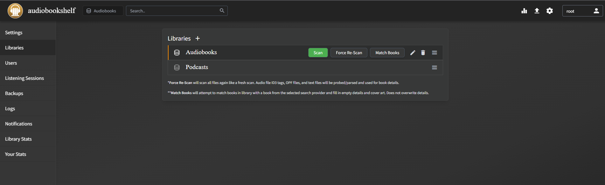

# Media Apps


# Rich Media

**Hello Everyone**

This is a demo consisting of medias.


Some Code

```bash
docker-compose up -d
```

```python
import os
import time

print("hello world")
if a=b:
  print(a)
elif b=c:
  try:
    print(c)
  except:
    print(c+a)
else:
  print("what is the meaning of life")
```

More sample media


[Portainer](https://portainer.io) is a software for <span style="background-color: rgb(224, 62, 45);">managing </span>doc<span style="color: rgb(132, 63, 161);">k</span>er<span style="color: rgb(35, 111, 161);"> container</span>s.

# Audiobookshelf

Audiobooks and podcasts.

Docker-compose, place it in the media apps compose media.yml

```yaml
version: "3.7"
services:
  audiobookshelf:
    image: ghcr.io/advplyr/audiobookshelf:latest
    environment:
      - AUDIOBOOKSHELF_UID=99
      - AUDIOBOOKSHELF_GID=100
    ports:
      - 13378:80
    volumes:
      - /mnt/m/Audios/audiobooks:/audiobooks # hard drive mount
      - /mnt/m/Audios/podcasts:/podcasts # hard drive mount
      - $HOME/audiobookshelf/config:/config
      - $HOME/audiobookshelf/metadata:/metadata
    restart: unless-stopped
```

**Using the software**

To add a library, go to settings, libraries and add the path as mounted in docker.

Go to Users, change the root password and create a new user. Note, the user cannot scan library, only the root can do that.



**Adding Media**

Make sure the contents are in a separate folder. Follow naming like this. A cover image can also be created. The best bitrate should be under 128 kbps for smooth playback.

```
/audiobooks
--- ./Author - Book
---  --- ./cover.jpg
---  --- ./book - 001 or book - chapter 1
---  --- ./book - 002
---  --- ./book - 003
```

In the WebUI, make sure logged in as root. Go to settings, library and scan. It will scan the newly added media.

If the media does not match or not have an image, go click the edit icon, go to Match, the best result is usually Audible.ca.


If the chapter does not match, chapters can be edited manually. Go to Chapter and Lookup.

**Mobile App**

**[https://play.google.com/store/apps/details?id=com.audiobookshelf.app](https://play.google.com/store/apps/details?id=com.audiobookshelf.app)**

Mobile app also has download functionality, however, the directory cannot be changed, the default for download is /Internal Storage/Download/{Podcast or Audiobook}

The statistic of minutes listened is the actual minutes listened, not the minutes of audiobook progress listened (eg. playing at faster speed).

**Scripting (Windows)**

ffmpeg detect audio silence (for splitting a large audio file into multiple chapters)

```shell
ffmpeg -i input.mp3 -af silencedetect=n=-50dB:d=1.5 -f null -
```

```shell
ffmpeg -i input.mp3 -af silencedetect=n=-50dB:d=1.5 -f null -loglevel debug 2>&1 - | findstr "silence_duration" | find /c /v ""
```

This will find silence parts below -50dB and duration threshold of 1.5s.

The second code (windows cmd only) for linux use grep -c, finds how many silence parts can be detected, this should correlate to number of chapters.

Once the optimal duration is set, use split.py.

ffmpeg that remove silence from audio

```shell
ffmpeg -i input.mp4 -af silenceremove=stop_periods=-1:stop_duration=4:stop_threshold=-50dB -b:a 96k output.mp3
```

- stop\_duration (threshold duration for removing silence part)
- stop\_periods = -1 (search for the entire audio track)

Use edge\_reader.py to utilize Edge AI reader to read the audiobook if only the pdf book is provided.

After reading, put all the recorded files and pdf in the project folder and run processing.py twice.


