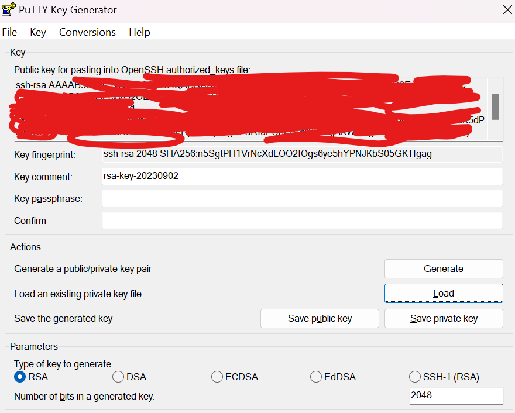

# Debian-Based Server Setup

Run update and upgrade distro first. Install NTP package is there are errors with that. Reboot

Setup powertop and powersaving features

```bash
sudo apt install powertop
powertop --auto-tune
```

Powersave governor and at reboot. Remember to run the command again

```bash
@reboot echo "powersave" | tee /sys/devices/system/cpu/cpu*/cpufreq/scaling_governor >/dev/null 2>&1
```

Ensure these packages are installedi

```bash
powertop htop iotop fio curl gnupg wget ntfs-3g neofetch ca-certificates lsb-release hdparm hd-idle openssh-server at autojump screen bash-completion
```

- after installing `bash-completion`, need to source `.bashrc` for Docker autocomplete to work
### HDD

`lsblk` and `blkid` to get the ntfs hard drive /dev name and the /dev/by-uuid/...

Edit the fstab to mount the drive, same entry for nvme drive

```bash
UUID=CC34294F34293E38 /mnt/data ntfs-3g 0 0
```

If the mounted device is HDD array, need to spindown disk with hdparm

```c
hdparm -B 120 /dev/sdb # set the APM level
hdparm -S 241 /dev/sdb
```

For the -S spindown, 0-240 is multiple of 5s, 241-255 is multiple of 30 min. The above command set spindown every 30min.

If hdparm does not work, hd-idle can be used. Edit the file in `/etc/defaults/hd-idle`

```
-i 60 -a disk/by-uuid/xxx -l /var/log/hd-idle.log
```

Sudo without password, go to visudo and add the lines to the bottom, replace $USER with the actual username.

```bash
$USER ALL=(ALL) NOPASSWD: ALL
```

Edit shortcuts in bashrc

```bash
source .bashrc
```

### OpenSSH with Keys

#### Generate the key using the terminal

```bash
ssh-keygen
```

- give a location to put the key pair
- this generate a public (.pub) and private key pair

```
ssh-copy-id -i key.pub username@server
```

- `key.pub` is the public key that was generated

The key is ready to use for authorization.

#### Generate keys using PuTTY software



1. Copy the red part and use nano to add it in the server `~/.ssh/authorized_keys`
2. Make sure permissions are correct
```bash
mkdir -p ~/.ssh
chmod 700 ~/.ssh
chmod 600 ~/.ssh/authorized_keys
nano ~/.ssh/authorized_keys
```
3. Save private key as ppk file on the root ssh folder.
4. If the client with private key is Linux machine, need to change the permission of the private key.
    
    ```bash
    chmod 600 private.key
    ```
5. Convert the private key Conversion &gt; Export OpenSSH Keys and save the file to a folder OpenSSH Keys
#### SSH Config
Configuration file for easy SSH access. The permission for that file is **644**.
```
Host server
  HostName 10.10.120.1
  User ubuntu
  IdentityFile ~/keys/server.key
```

>[!note] Use with [OliveTin](olivetin.md)
> To have seamless ssh experience with OliveTin, make sure to copy the `ssh config` file and all the keys to `/root`, since in OliveTin `~` means `/root` not your user home directory.

### Setting Up SMB

Refer to [Samba(SMB) Setup](sambasmb-setup.md) to setup SMB server.
### Desktop Environment Setup

#### Firefox

The location of firefox profile is at /home/$USER/.mozilla/firefox/xxxxx.default

Make a tarball and copy it and extract it in destination.

In the profile folder, look for compatibility.ini, go to a random profile in the dest machine and copy the compatibility.ini settings to the one that is copied over. This ensure compatibility so that the new profile works without warning.

Check the profile.ini with the name and the location of the new profile folder, firefox should be the same as before.

```
[Profile0]
Name=karis
IsRelative=1
Path=ims58kbd.default-esr-1
```

**Themes**

To backup/restore settings of cinnamon

**Icons**

The icons are located at these locations.

```shell
/usr/share/icons
~/.icons
```

**Scripts**

Copy the scripts and put it into ~/script for organization and copy the old crontab for executing these scripts.