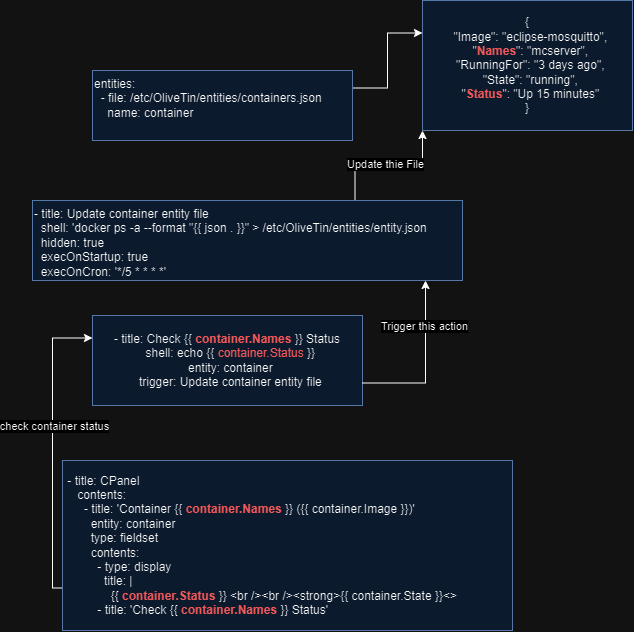

# OliveTin

OliveTin exposes a webpage with buttons that execute shell command (eg. docker, scripts) on the server and allow others for easy access. It should be used internally only.

Main Interface

Log Interface


#### Installation

Download the correct file from this site. [https://github.com/OliveTin/OliveTin/releases](https://github.com/OliveTin/OliveTin/releases) *OliveTin\_linux\_amd64.deb*

Go to the directory and install the package.
- if a previous `config.yaml` is already present, installer will ask what to do, the default is to keep the previous config
```bash
sudo dpkg -i OliveTin…​deb
sudo systemctl enable --now OliveTin
```

**Uninstall**
```bash
sudo dpkg -r OliveTin # the installed app name, not the deb file
```
### Configuration
The configuration file is located at `/etc/OliveTin/config.yaml`
> [!important]+ Script Execution User 
> By default, OliveTin always execute script as root!! This have complications. With an example script that echo some location,  create a file in`/opt` dir owned by user 1000 and cd into `~/Downloads` user 1000's download dir.
> >[!info]- default
> >`/root/Downloads/`
> >`line 7: cd: /root/Downloads: No such file or directory`
> >The file created by the script is owned by root and not editable in VSCode or other editor unless using `sudo`
> 
> >[!info]- as user 1000
> >`/home/test/Downloads/`
> >The file created by the script is owned by user and can be freely edited.
> 
> Run command as user user `sudo -u user /path/to/script`. 
> - `~` path works as intended
> - all files created and modified will be owned by user not root
> - `bashrc` variables do not work, to use environment variables, it must be sourced elsewhere
> - by default, the script has a `$PWD` at `/root`, so relative path do not work regarding files
 
**Example Configuration**
```yaml
listenAddressSingleHTTPFrontend: 0.0.0.0:1378 # set the port to 1378

# Choose from INFO (default), WARN and DEBUG
logLevel: "INFO"

actions:
- title: Update Music
  shell: /home/karis/scripts/script
  icon: '&#127925'
  timeout: 2
  hidden: true
```
Configuration consists of list of actions, each action consist of `title`, `shell`, [icon](#icons)

- `timeout` is also optional, the task will be killed if it takes longer (in seconds) to complete
- `hidden` will **hide it from dashboard**
	- to unhide, a service restart is needed
- `maxConcurrent` optional, only allow x runs for the duration of the execution, any more will be blocked 
- [rateLimit](https://docs.olivetin.app/ratelimits.html) more advance limiting
	- to clear a rate limit, OliveTin has to be restarted
```yaml
    maxRate:
      - limit: 3
        duration: 5m
```
#### Arguments
##### Textbox Input
```yaml
- title: Restart a Docker CT
  icon: ''
  shell: docker restart {{ container }}
  arguments:
    - name: container
      type: ascii
```

- use `{{ }}` and give a variable
- under arguments type, assign a type for it, `ascii` only allows letters and numbers
##### Dropdown Choices
```yaml
- title: Manage Docker Stack Services
  icon: "&#128736;"
  shell: docker-compose -f /home/karis/docker/bookstack/docker-compose.yml {{ action }}
  arguments:
    - name: action
      choices:
        - title: Start Stack
          value: up -d
        - title: Stop Stack
          value: down
```
This example give choices to start or stop a docker stack of a docker-compose file. If a argument is given the parameter choices, it will be in dropdown mode.
##### Suggestion
Suggestion is a hybrid between dropdown and textbox. It will suggest the list of possible items in browser but do not restrict choices.
```yaml
  arguments:
    - name: action
      title: Action Name
      suggestions:
        - value: Information
```

- `value` is what is passed onto the shell and `Information` is a text display for clarification

After modifying configuration, it require a restart to clear out previous suggestions for browsers.
##### Execute on files created in a directory
```yaml
- title: Update Songs
  icon: <iconify-icon icon="mdi:music"></iconify-icon>
  shell: /home/test/scripts/file.sh {{ filepath }}
  arguments:
    - name: filepath
      type: unicode_identifier
  execOnFileCreatedInDir: 
    - /home/test/Downloads/
    - /another/folder
```
Whenever a new file is created the action will execute.

- `execOnFileCreatedInDir`
	- it is possible to add multiple path to monitor; however, adding a path require a restart of OliveTin service
- same principle as `Arguments`, whereas OliveTin provides [predefined arguments](https://docs.olivetin.app/exec-file-created.html) for files. `filepath` is the full absolute path of the file that is created
#### Execution Feedback
```yaml
- title: some action
  popupOnstart: default, execution-dialog-stdout-only, execution-dialog, execution-button
```

| default                                         | stdout-only                                     | dialog                                          | button                                          |
| ----------------------------------------------- | ----------------------------------------------- | ----------------------------------------------- | ----------------------------------------------- |
|  |  |  |  |
- popup dialog have an option to only show `stdout` or show full log output with exit code
- button will show how long the process take
- the design of popup box may not be easy to close, use the keyboard ++Esc++ key to close

##### Confirmation
It is possible to have a confirmation before completing action.
```yaml
  arguments:
    - type: confirmation
      title: Click start to begin.
```

- user must click a checkbox and then start before the action will execute
- API do not have such restrictions
### Icons
The icons need to be placed in a folder in */var/www/\[icon-folder\]/icon.png.* To use the icons, offline image or web address, it should be in HTML format. The size of 48px is the default size of OliveTin icons. Other CSS options such as `style="background-color: white;"` also works.
```yaml
icon: ''
```
Icon with emoji, to use emoji, need to use the html code. [https://symbl.cc/en/emoji/](https://symbl.cc/en/emoji/)
For example, `&#9786;` <span class="symbol-main__title--symbl">😊.</span>
```yaml
icon: "&#9786;"
```
##### Third-Party
Olivetin only support [iconify](https://icon-sets.iconify.design/) icons. To use it, search for an icon, under `components` select `Iconify Icon`

Add the pasted line into the configuration.
```yaml
  - title: Title
    icon: <iconify-icon icon="openmoji:jellyfin"></iconify-icon>
```
#### Icon Management
The default icon folder is `/var/www/olivetin/icons`
The icon folder of all homelab icons is in `~/icons/homelab`

### API
Simple action button.
```bash
curl -X POST "http://mediaserver:1378/api/StartAction" -d '{"actionId": "Update Music"}'
```
Action with Arguments.
```bash
curl -X POST 'http://mediaserver:1378/api/StartAction' -d '{"actionId": "Rename Movies", "arguments": [{"name": "location", "value": "value"}]}'
```

> [!bug]- Arguments variable cannot be "path"
> If `path` is used as argument, when executing commands with arguments, it will replace the system `$PATH` variable, this will render most commands useless even basic ones like `sleep`, `date` etc. Use another variable such as `directory` or `location`

>[!bug]+ Newest Olivetin Version Break Old API Method
>The `actionName` key is deprecated and no longer works, newest Olivetin API only allow `actionId` for `StartAction` API endpoint. The scripts above are adjusted accordingly. To migrate, the easiest way it to create a ID in configuration that has the same value as action name.
>```yaml
>- title: action name
>- id: action name
>```
>

### Dashboard
Dashboard are a separate page from the default OliveTin page, [Fieldsets](#Fieldsets) and [Folders](#Folders) are allowed to group actions only in dashboard.
- when an action is in dashboards, it does not appear in main view.
- when refreshing the page, it will always go back to main view even if the page is currently at a dashboard
```yaml
dashboards:
  - title: My Dashboard
    contents:
      - title: Title Desc
        type: fieldset
        contents:
          - title: Fix Epic Games
          - title: Restart Minecraft
      - title: Update Metadata
        type: fieldset
        contents:
          - title: Stuff
            icon: ''
            contents:
               - title: Update Songs
```
>[!notes]- Preview
>
#### Fieldsets
[Fieldsets](https://docs.olivetin.app/fieldsets.html) are group of actions under a title. Any `title` that has `type: fieldset` defined is a fieldset, any actions are grouped under `contents` key and need to have matching title.
#### Folders
[Folders](https://docs.olivetin.app/folders.html) also group actions together in a dashboard and user need to click into the folder to see the actions.

- it is possible to use custom icons or title for folders as long as `type: ` is not set and it has `contents: `
### Entities
To use entities, an [action](#entity%20actions), a [dashboard](#dashboard) [entry](#dashboard%20entry), entities json/yaml [file](#entities.json) and entity update method is needed (when the action interact with the entity).
>[!info]- Preview of Entities Flowchart
>
#### entities.json
It's also possible to use [YAML](https://docs.olivetin.app/entities-yaml.html)
```yaml
entities:
  - file: /etc/OliveTin/entities/containers.json
    name: container
```

- entities file are stored in `/etc/OliveTin/entities`
- the name of the entity will be reference as `container.attributes` in configuration
#### entity update
```yaml
- title: Update container entity file
  shell: 'docker ps -a --format "{{ json . }}" > /etc/OliveTin/entities/entity.json
  hidden: true
  execOnStartup: true
  execOnCron: '*/5 * * * *'
```

- this is an action that is trigger by other actions that need to modify the entity, the purpose is to update [the entity file](#entities.json)
#### entity actions
```yaml
- title: Check {{ container.Names }} Status
  shell: echo {{ container.Status }}
  entity: container
  trigger: Update container entity file
```

The entity action is defined the same way as other actions.
- `entity` need to be defined
- `trigger` automatically update entity attributes (since executing this actions could change some attribute of an entity like starting a container)
- both title and shell can use `entity.attributes`
#### dashboard entry
```yaml
 - title: CPanel
    contents:
      - title: 'Container {{ container.Names }} ({{ container.Image }})'
        entity: container
        type: fieldset
        contents:
          - type: display
            title: |
              {{ container.Status }} <br /><br /><strong>{{ container.State }}<>
          - title: 'Check {{ container.Names }} Status'
```
>[!notes]- Preview
>
- dashboard is the same configuration as in [previous](#Dashboard) but now is able to utilize entities. 