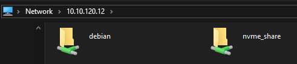

# Samba(SMB) Setup

### Setting up SMB Server on Linux

Install the samba tool on Linux.

```bash
sudo apt update
sudo apt install samba -y
```

Edit the `/etc/samba/smb.conf`

```yaml
[nvme_share]
   comment = NVMe Share
   path = /mnt/nvme/share
   browseable = yes
   read only = no
```

`nvme_share` is the name of the Samba path which will appear in SMB clients and its path is accessed by `\\192.168.0.1\nvme_share`



`path` is the location where the files are stored

`browseable` and `read only` are flags that are needed to make sure read/write access on the SMB share

Lastly, add the user and password for the SMB share

```bash
sudo smbpasswd -a $USER # enter the password twice
```

In the case when Windows fail to write files in the samba share for odd reason. Go to `Manage Credentials` -> `Windows Credentials` -> `Add a Windows Credential` and fill the necessary address, username and password.